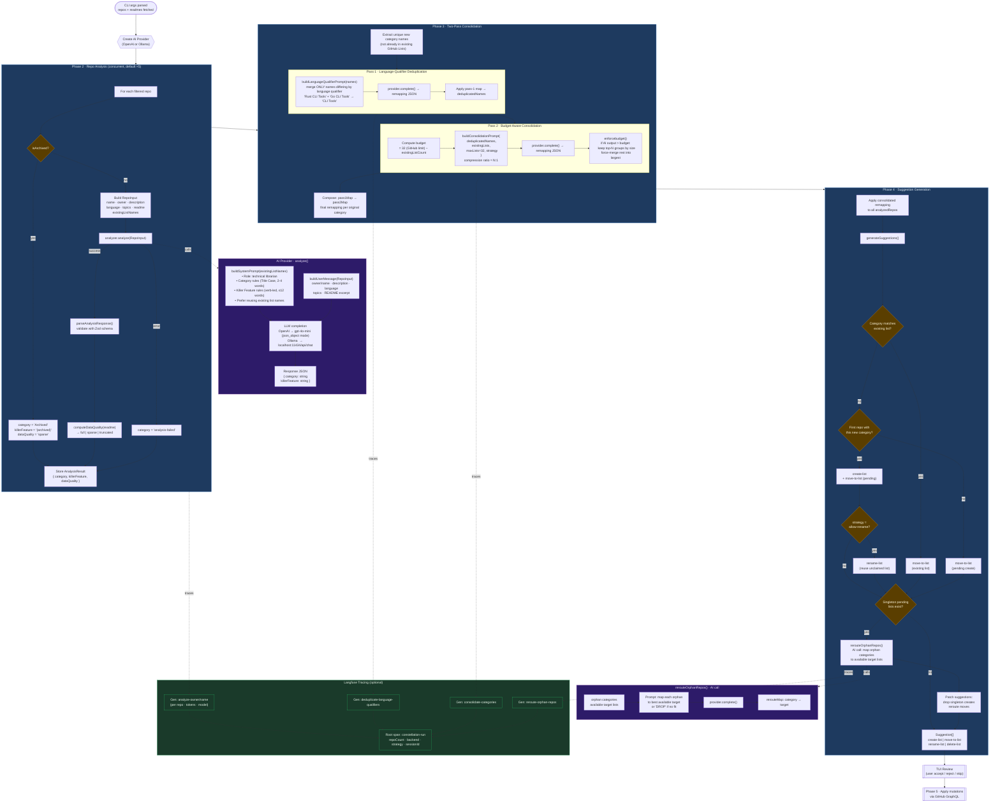

# AI Engine Workflow

## AI Calls Summary

| Step | Function | Prompt builder | Purpose |
|------|----------|---------------|---------|
| Repo Analysis | `analyzer.analyze()` | `buildSystemPrompt` + `buildUserMessage` | Classify each repo → category + killer feature |
| Consolidation Pass 1 | `provider.complete()` | `buildLanguageQualifierPrompt` | Merge names differing only by language qualifier |
| Consolidation Pass 2 | `provider.complete()` | `buildConsolidationPrompt` | Budget-aware merging to stay within 32-list GitHub limit |
| Singleton Rerouting | `provider.complete()` | _(inline in suggestionEngine)_ | Reroute orphan single-repo categories to existing targets |

## Data Quality Labels

| Label | Meaning |
|-------|---------|
| `full` | README ≥ quality threshold |
| `sparse` | README < 50 chars, or repo is archived |
| `truncated` | README truncated by 4 000-char fetch limit |
